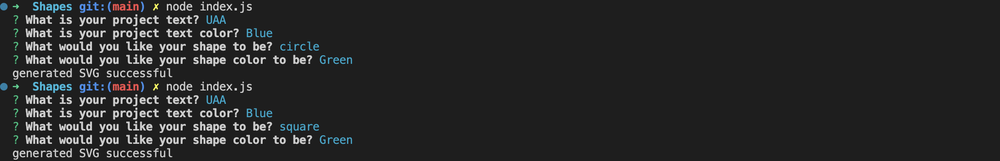

# Logo Creator
  
  
## Description
My motivation to create this project was to make a to create a logo generator that will run in node. I built this project to create a streamlined way to create a logo for a project. This application solves the problem of not having a node application to create a logo. I learned how to use node to create this application.

## Deployed Site

This is a node application and it is accessible on the command line.

## Installation

To install the project, pull the code from https://www.github.com/stefanfilm/Shapes and open it in a code editor. Open the index.js in the code editor and view the JavaScript. Create a package.json and run npm init. Answer the questions. Install Inquirer and Jest. 

## Usage

Navigate to the directory in the code editor and go to the command line. Type in node index.js. Answer the prompts. A .svg logo file will generate. Here is a video walkthrough. https://drive.google.com/file/d/1MO2qSy7jxmX3ksrufNVDVsfSM6xrgg3k/view?usp=sharing

    ```md
    
    ```


  ## License
  This project is licensed with the MIT license.
  

  ## Contributions
  Self. This project was made under the instruction of Mark Carlson in the UC Berkeley Software Development Bootcamp.

  ## Questions
  You can contact me at stefan.wanigatunga@gmail.com
  My GitHub Username is stefanfilm